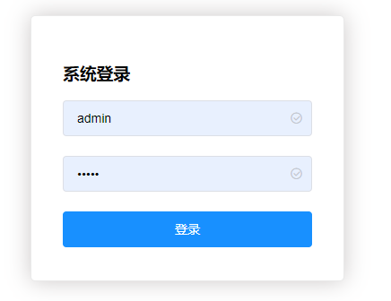
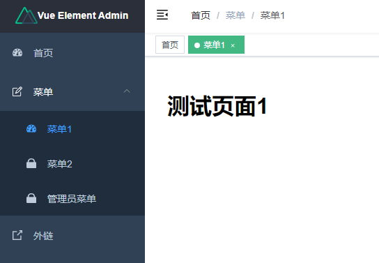
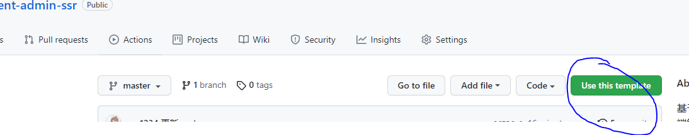

# Element Admin SSR

基于Element UI + Nuxt + Express的前后端管理方案，服务端渲染

## 简单来说就是 Element Admin + 服务端渲染

为什么要使用服务端渲染：
最大的好处就是开发快、支持SEO

# 特点

前端是使用的Vue，后端是[Nuxt.js](https://www.nuxtjs.cn/guide) 、[Express](https://www.expressjs.com.cn/)

两者运行在同一个容器中，省去了传统前后端分离应用的交互

**适合开发要求快或者需要SEO，对并发性能要求不高的应用**

- 开箱即用
- 登录 / 注销 / 权限验证
- 服务端渲染
- 移动端页面兼容
- 动态菜单
- 动态侧边栏
- 快捷导航(标签页)
- SVG图标
- Express接口开发支持

效果图

# 运行

1.克隆项目，安装依赖，执行 `yarn install` 或者 `npm install`

2.执行`npm run dev`

3.浏览器打开 localhost:3000

账号：
- 管理员 admin 密码：admin
- 用户 user 密码：user
- 用户 zhangsan 密码：123456

# 开发

去Github，访问 [https://github.com/xcr1234/element-admin-ssr](https://github.com/xcr1234/element-admin-ssr)

点这个，会把项目代码拷贝到自己空间

# 生产发布

1.执行`npm run build`

2.编译后的所有文件在dist/下，拷贝到生产目录

3.把node_modules拷贝到生产目录，或者去生产目录执行`npm install`

4.执行`npm run start`

# 详细文档

https://gitee.com/ironV/element-express/wikis

# 提问

去Github提Issue，或者在码云评论
